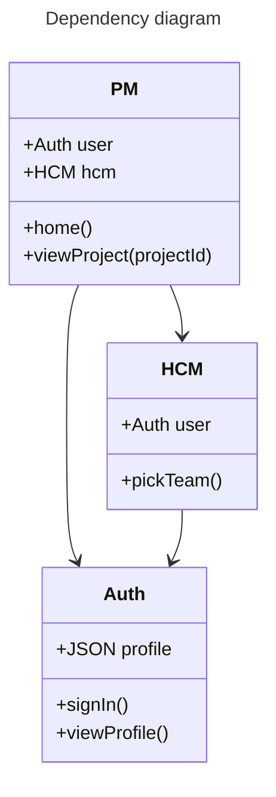

# Project management application demo

This demo application shows how the [Qworum](https://qworum.net) platform helps build __highly integrated IT systems__ on top of fragmented application landscapes.

Key concepts:

- Application integration.
- Distributed applications.

## Qworum-based project management (PM) application

This application allows project managers to use a remote HCM service for choosing project members.

And a common identity service is used by both services for authenticating the end-users.

This application is structured as a Qworum API, and it has the following endpoints:

- `home` is the application's main entry point.
- `view-project` which is called by `home`; other remote services/applications can also call this endpoint.

## Dependencies

This Qworum application depends on these Qworum applications/services:

- [User authentication service](https://github.com/doga/qworum-demo-auth)
- [HCM application](https://github.com/doga/qworum-demo-hcm)

In this demo, all three services/applications are hosted on different web servers, but colocating different Qworum APIs on the same server is allowed as well.

## Running this demo locally

This is one way to do it:

1. Install [Visual Studio Code](https://code.visualstudio.com/)
1. Install the [Live Server extension for Visual Studio Code](https://marketplace.visualstudio.com/items?itemName=ritwickdey.LiveServer)
1. Start Live Server for the Auth project and the HCM project.
1. Lastly do this for this project: Left-click on the `dist/index.html` file and choose _Open with Live Server_ on the pop-up menu that appears.

This way of running the demo ensures that each web server runs on the right local TCP port.

## License

This software is released under the terms of the [Apache 2.0 license](https://www.apache.org/licenses/LICENSE-2.0).

∎
